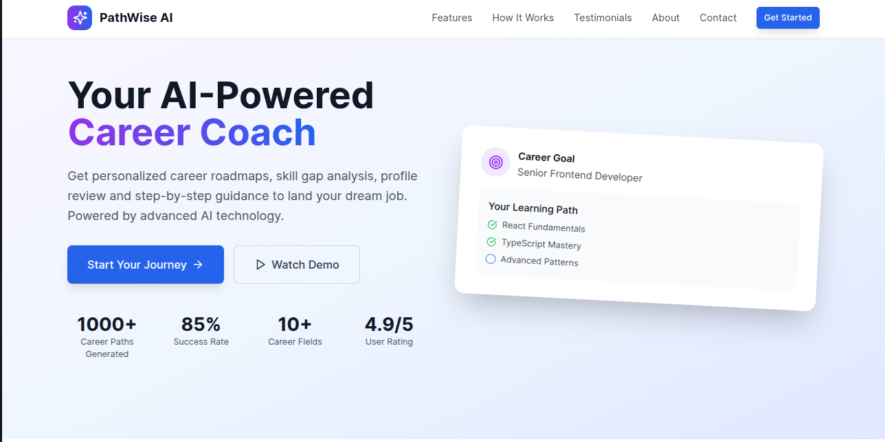
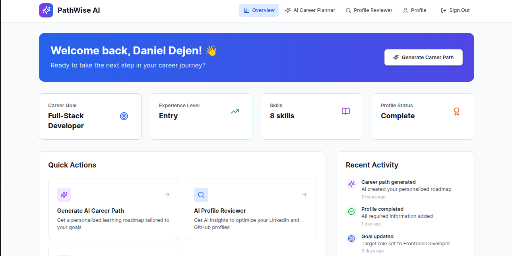
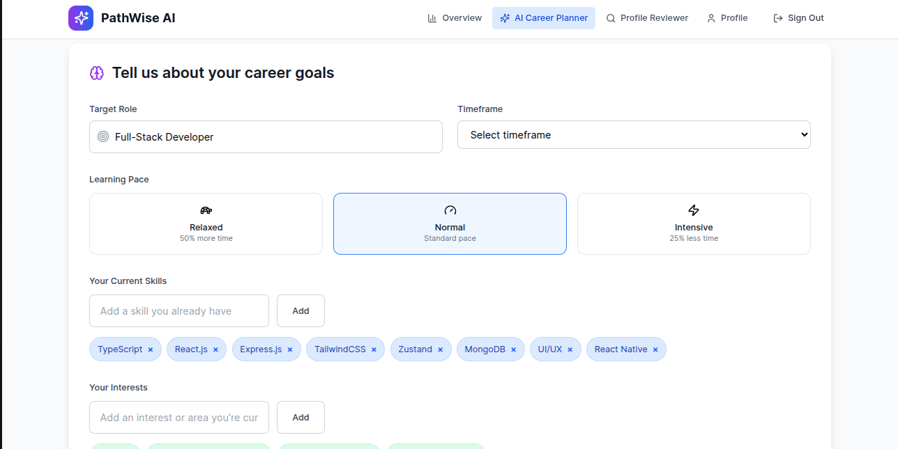

# PathWise AI

A comprehensive AI-powered career development platform that helps professionals advance their careers through personalized guidance, skill analysis, and intelligent recommendations.

## 🚀 Overview

PathWise AI (formely Job-Ready-AI-Coach) is a full-stack web application that leverages artificial intelligence to provide personalized career coaching. The platform offers AI-driven career path generation, profile optimization, resume analysis, and skill gap identification to help users achieve their professional goals.

## Landing Page



## Dashboard 



## Career Path Planner Page



## Profile Review Page


## ✨ Features

### 🎯 AI Career Path Planner
- **Personalized Learning Roadmaps**: Generate custom career paths based on your goals, current skills, and learning pace
- **Weekly Learning Plans**: Structured week-by-week guidance with resources, milestones, and projects
- **Adaptive Pacing**: Choose from slow, normal, or intensive learning speeds
- **Progress Tracking**: Monitor your advancement through interactive dashboards

### 🔍 AI Profile Reviewer
- **LinkedIn Profile Analysis**: Comprehensive AI review of LinkedIn profiles with actionable insights
- **GitHub Profile Optimization**: Analyze GitHub profiles for developer visibility and impact
- **Industry Benchmarking**: Compare your profile against industry standards
- **Improvement Recommendations**: Prioritized suggestions for profile enhancement

### 📄 AI Resume & CV Reviewer
- **Comprehensive Analysis**: AI-powered resume analysis covering content, structure, and ATS compatibility
- **Skills Assessment**: Identify skill gaps and get recommendations for improvement
- **Industry-Specific Insights**: Tailored feedback based on target roles and industries
- **ATS Optimization**: Ensure your resume passes Applicant Tracking Systems

### 👤 Profile Management
- **Complete Profile Setup**: Guided profile creation with education, experience, and career goals
- **Skill Tracking**: Manage and showcase your technical and soft skills
- **Learning Progress**: Track completed resources, milestones, and achievements
- **Goal Setting**: Define and monitor career objectives

### 🔐 Authentication & Security
- **Multiple Login Options**: Email/password and Google OAuth integration
- **Email Verification**: Secure account verification process
- **Password Management**: Forgot password and change password functionality
- **Session Management**: Secure JWT-based authentication

### 📊 Analytics & Insights
- **Progress Analytics**: Visualize your learning journey and improvements
- **Performance Metrics**: Track scores, completion rates, and trends
- **Personalized Insights**: AI-generated recommendations based on your activity

## 🛠️ Technology Stack

### Frontend
- **React 18** with TypeScript
- **Tailwind CSS** for styling
- **React Router** for navigation
- **React Hook Form** with Zod validation
- **Zustand** for state management
- **Vite** for build tooling

### Backend
- **Node.js** with Express.js
- **TypeScript** for type safety
- **MongoDB** with Mongoose ODM
- **JWT** for authentication
- **Passport.js** for OAuth
- **Multer** & **Cloudinary** for file uploads

### AI Integration
- **Grok AI** (xAI) for intelligent analysis and recommendations
- **GitHub Models API** for AI-powered insights
- **Custom AI prompts** for career guidance and profile optimization

### Additional Services
- **Nodemailer** for email services
- **bcryptjs** for password hashing
- **Helmet** for security headers
- **Rate limiting** for API protection

## 📁 Project Structure

```
Job-Ready-AI-Coach/
├── backend/                          # Node.js backend application
│   ├── src/
│   │   ├── configs/                  # Configuration files
│   │   │   ├── cloudinary.ts         # Cloudinary setup
│   │   │   ├── db.ts                 # Database connection
│   │   │   └── passport.ts           # Passport OAuth config
│   │   ├── controllers/              # Route controllers
│   │   │   ├── auth.controller.ts    # Authentication logic
│   │   │   ├── career.controller.ts  # Career planning logic
│   │   │   ├── profile.controller.ts # Profile management
│   │   │   ├── profileReviewer.controller.ts
│   │   │   └── resumeReviewer.controller.ts
│   │   ├── middlewares/              # Express middlewares
│   │   │   ├── auth.middleware.ts    # JWT authentication
│   │   │   ├── error.middleware.ts   # Error handling
│   │   │   └── validation.middleware.ts
│   │   ├── models/                   # MongoDB schemas
│   │   │   ├── user.model.ts         # User schema
│   │   │   ├── profile.model.ts      # Profile schema
│   │   │   ├── career.model.ts       # Career path schema
│   │   │   ├── profileReview.model.ts
│   │   │   └── resumeReview.model.ts
│   │   ├── routes/                   # API routes
│   │   │   ├── auth.route.ts         # Authentication routes
│   │   │   ├── career.route.ts       # Career planning routes
│   │   │   ├── profile.route.ts      # Profile routes
│   │   │   ├── profileReviewer.route.ts
│   │   │   └── resumeReviewer.route.ts
│   │   ├── services/                 # Business logic services
│   │   │   ├── email.service.ts      # Email functionality
│   │   │   ├── grok.service.ts       # AI integration
│   │   │   ├── resumeParser.service.ts
│   │   │   └── resumeAnalyzer.service.ts
│   │   ├── utils/                    # Utility functions
│   │   │   ├── auth.utils.ts         # Auth helpers
│   │   │   └── validation.utils.ts   # Validation helpers
│   │   └── server.ts                 # Express server setup
│   ├── package.json                  # Backend dependencies
│   ├── tsconfig.json                 # TypeScript config
│   └── .env.example                  # Environment variables template
├── frontend/                         # React frontend application
│   ├── public/
│   │   └── favicon.svg               # App favicon
│   ├── src/
│   │   ├── components/               # React components
│   │   │   ├── ui/                   # Reusable UI components
│   │   │   │   ├── Button.tsx
│   │   │   │   ├── Input.tsx
│   │   │   │   ├── Select.tsx
│   │   │   │   ├── Textarea.tsx
│   │   │   │   └── Toast.tsx
│   │   │   ├── career/               # Career-related components
│   │   │   │   ├── AICareerPathPlanner.tsx
│   │   │   │   ├── WeeklyLearningPlan.tsx
│   │   │   │   └── SkillGapAnalysis.tsx
│   │   │   ├── dashboard/            # Dashboard components
│   │   │   │   ├── Navbar.tsx
│   │   │   │   ├── WelcomeHeader.tsx
│   │   │   │   ├── QuickActions.tsx
│   │   │   │   └── QuickStats.tsx
│   │   │   ├── profile/              # Profile components
│   │   │   │   ├── ProfileSetup.tsx
│   │   │   │   ├── ProfileReviewer.tsx
│   │   │   │   └── LinkedInDataForm.tsx
│   │   │   ├── resume/               # Resume components
│   │   │   │   └── resumeReviewer.tsx
│   │   │   ├── Dashboard.tsx         # Main dashboard
│   │   │   ├── LandingPage.tsx       # Landing page
│   │   │   ├── LoginPage.tsx         # Authentication
│   │   │   └── LoadingSpinner.tsx    # Loading component
│   │   ├── stores/                   # Zustand state stores
│   │   │   ├── authStore.ts          # Authentication state
│   │   │   ├── profileStore.ts       # Profile state
│   │   │   └── careerStore.ts        # Career state
│   │   ├── services/                 # API services
│   │   │   └── api.ts                # API client
│   │   ├── schemas/                  # Validation schemas
│   │   │   └── profileSchema.ts      # Zod schemas
│   │   ├── types/                    # TypeScript types
│   │   │   ├── auth.ts               # Auth types
│   │   │   └── dashboard.ts          # Dashboard types
│   │   ├── utils/                    # Utility functions
│   │   │   └── cn.ts                 # Class name utility
│   │   ├── App.tsx                   # Main App component
│   │   ├── main.tsx                  # React entry point
│   │   └── index.css                 # Global styles
│   ├── package.json                  # Frontend dependencies
│   ├── tailwind.config.js            # Tailwind configuration
│   ├── tsconfig.json                 # TypeScript config
│   └── vite.config.ts                # Vite configuration
├── Job-Ready-AI-Coach.postman_collection.json  # API documentation
├── LICENSE                           # MIT License
├── README.md                         # Project documentation
└── package.json                      # Root package.json
```

## 🚀 Getting Started

### Prerequisites

- Node.js (v18 or higher)
- MongoDB (local or cloud instance)
- Grok AI API key (from xAI)
- Cloudinary account (for file uploads)
- Google OAuth credentials (optional)

### Installation

1. **Clone the repository**
   ```bash
   git clone https://github.com/yourusername/Job-Ready-AI-Coach.git
   cd Job-Ready-AI-Coach
   ```

2. **Install dependencies**
   ```bash
   # Install backend dependencies
   cd backend
   npm install

   # Install frontend dependencies
   cd ../frontend
   npm install
   ```

3. **Environment Setup**
   
   **Backend** (`backend/.env`):
   ```env
   # Database
   MONGO_URI_LOCAL=mongodb://localhost:27017/job-ready-ai-coach

   # JWT
   JWT_SECRET=your-super-secret-jwt-key-here

   # Session
   SESSION_SECRET=your-session-secret-here

   # Google OAuth (optional)
   GOOGLE_CLIENT_ID=your-google-client-id
   GOOGLE_CLIENT_SECRET=your-google-client-secret

   # Email Configuration
   EMAIL_USER=your-email@gmail.com
   EMAIL_PASSWORD=your-app-password
   EMAIL_FROM=noreply@jobreadyai.com

   # Frontend URL
   FRONTEND_URL=http://localhost:5173

   # Server
   PORT=3000

   # Grok AI Configuration
   GITHUB_TOKEN=your-github-token-for-models-api
   ```

   **Frontend** (`frontend/.env`):
   ```env
   VITE_API_URL=http://localhost:3000
   ```

4. **Start the development servers**
   
   **Backend**:
   ```bash
   cd backend
   npm run dev
   ```

   **Frontend** (in a new terminal):
   ```bash
   cd frontend
   npm run dev
   ```

5. **Access the application**
   - Frontend: http://localhost:5173
   - Backend API: http://localhost:3000

## 📖 API Documentation

The project includes a comprehensive Postman collection (`Job-Ready-AI-Coach.postman_collection.json`) with all API endpoints documented. Import this collection into Postman to explore the API.

### Key API Endpoints

- **Authentication**: `/auth/*` - Login, signup, OAuth, password management
- **Profile**: `/profile/*` - User profile management
- **Career**: `/career/*` - AI career path generation and management
- **Profile Reviewer**: `/profile-reviewer/*` - LinkedIn/GitHub profile analysis
- **Resume Reviewer**: `/resume-reviewer/*` - Resume analysis and feedback

## 🤝 Contributing

1. Fork the repository
2. Create a feature branch (`git checkout -b feature/amazing-feature`)
3. Commit your changes (`git commit -m 'Add some amazing feature'`)
4. Push to the branch (`git push origin feature/amazing-feature`)
5. Open a Pull Request

## 📄 License

This project is licensed under the MIT License - see the [LICENSE](LICENSE) file for details.

## 🙏 Acknowledgments

- [xAI Grok](https://x.ai/) for AI-powered insights
- [GitHub Models](https://github.com/marketplace/models) for AI integration
- [Cloudinary](https://cloudinary.com/) for file storage
- [MongoDB](https://www.mongodb.com/) for database services
- [Tailwind CSS](https://tailwindcss.com/) for styling

## 📞 Support

For support, email hello@jobreadyai.com or create an issue in this repository.

## 🔮 Roadmap

- [ ] Mobile application (React Native)
- [ ] Advanced AI coaching conversations
- [ ] Integration with job boards
- [ ] Salary negotiation guidance
- [ ] Interview preparation tools
- [ ] Team collaboration features
- [ ] Advanced analytics dashboard

---

**Built with ❤️ by the Job Ready AI Coach team**